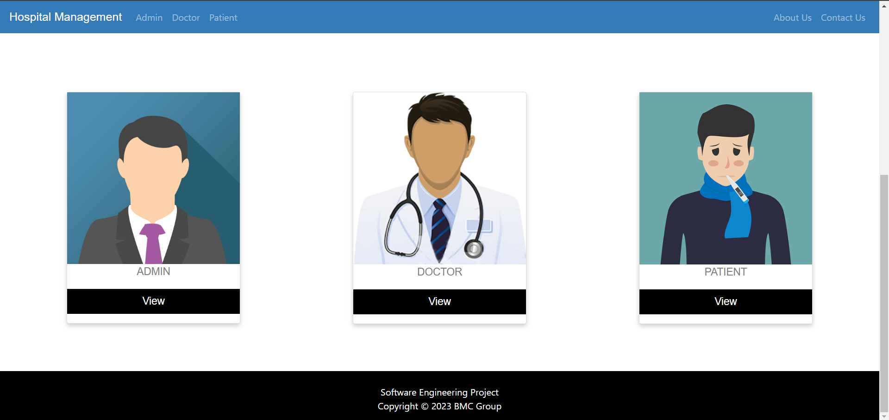
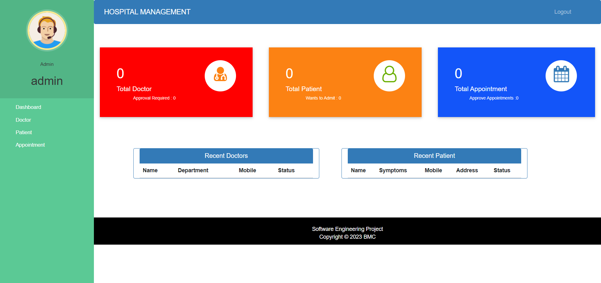
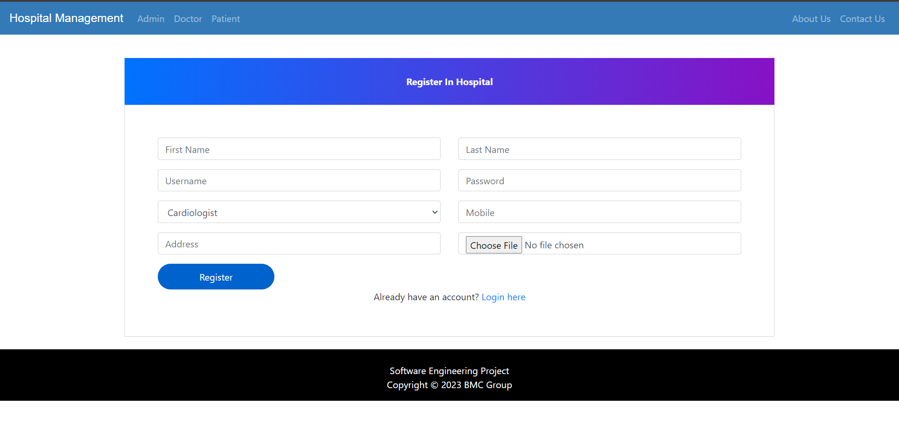
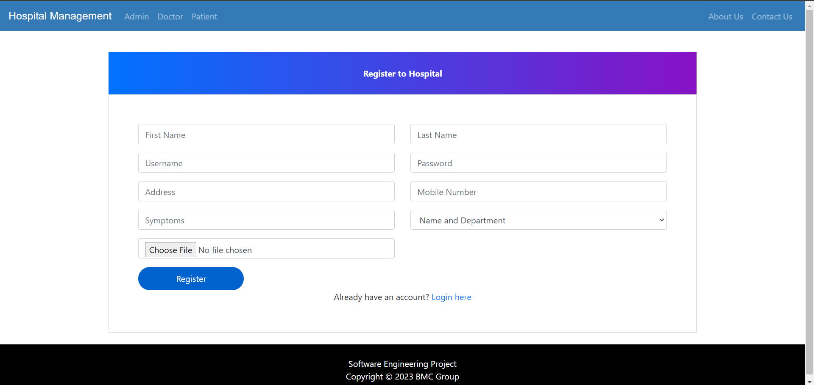

# Hospital Management

---
## Credits
This is a custom push changes to:
![credits]```(https://github.com/sumitkumar1503/hospitalmanagement)```
## screenshots
### Homepage

### Admin Dashboard

### Doctor Signup

### Patient Signup

---
## Functions
### Admin
- Signup their account. Then Login (No approval Required).
- Can register/view/approve/reject/delete doctor (approve those doctor who applied for job in their hospital).
- Can admit/view/approve/reject/discharge patient (discharge patient when treatment is done).
- Can Generate/Download Invoice pdf (Generate Invoice according to medicine cost, room charge, doctor charge and other charge).
- Can view/book/approve Appointment (approve those appointments which is requested by patient).

### Doctor
- Apply for job in hospital. Then Login (Approval required by hospital admin, Then only doctor can login).
- Can only view their patient details (symptoms, name, mobile ) assigned to that doctor by admin.
- Can view their discharged(by admin) patient list.
- Can view their Appointments, booked by admin.
- Can delete their Appointment, when doctor attended their appointment.

### Patient
- Create account for admit in hospital. Then Login (Approval required by hospital admin, Then only patient can login).
- Can view assigned doctor's details like ( specialization, mobile, address).
- Can view their booked appointment status (pending/confirmed by admin).
- Can book appointments.(approval required by admin)
- Can view/download Invoice pdf (Only when that patient is discharged by admin).

---

## HOW TO RUN THIS PROJECT
- Install Python(3.7.6) (Dont Forget to Tick Add to Path while installing Python)
- Download This Project Zip Folder and Extract it
- Move to project folder in Terminal. 
- Open Terminal and Execute Following Commands :
```
pip install django==3.0.5
pip install django-widget-tweaks
pip install xhtml2pdf
```
- Or Simply execute the following command :
```
pip install -r requirement.txt
```
- Then run following Commands :
```
py manage.py makemigrations
py manage.py migrate
py manage.py runserver
```
- Now enter following URL in Your Browser Installed On Your Pc
```
http://127.0.0.1:8000/
```

## CHANGES REQUIRED FOR CONTACT US PAGE
- In settins.py file, You have to give your email and password
```
EMAIL_HOST_USER = 'youremail@gmail.com'
EMAIL_HOST_PASSWORD = 'your email password'
EMAIL_RECEIVING_USER = 'youremail@gmail.com'
```
- Default admin creds are:
```
admin | admin
```
## Drawbacks/LoopHoles
- Any one can be Admin. There is no Approval required for admin account. So you can disable admin signup process and use any logic like creating superuser.
- There should be at least one doctor in hospital before admitting patient. So first add doctor.
- On update page of doctor/patient you must have to update password.

## Disclaimer
This project is developed for demo purpose and it's not supposed to be used in real application.

